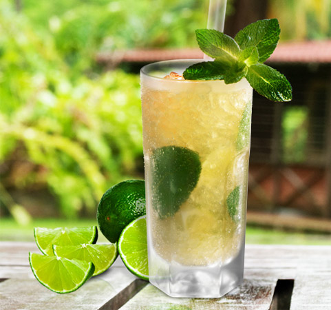

# Coktail au Rhum

## Le Don Papa Julep

### Ingrédients
+ 5 cl de **rhum Don Papa**
+ 2 cl de jus de calamondin 
+ 2 sucre brun liquide cl 
+ 1 bouquet de feuilles de menthe, y compris les tiges 
+ 2 quartier d’un citron vert frais (lime)

Un cocktail original qui puise dans les racines philippines du rhum Don Papa. L’utilisation de jus de calamondin (petit oranger d’appartement au goût aromatique, amère et acide) évoque largement cette région du monde car le kalamansi, autre nom du calamondin, est largement utilisé dans la cuisine philippine.

Ecraser les quartiers du citron vert et la menthe à l’aide d’un pilon puis ajouter l’ensemble des ingrédients dans un shaker. Secouer avec force. Filtrer et servir dans un long verre rempli de glace. Décorer avec un brin de menthe, des rondelles de citron et ajouter 2 gouttes de bitter thaïlandais pour rehausser la palette aromatique.

---

Ce contenu est pris de [cette](https://www.comptoir-irlandais.com/fr/blog/meilleurs-cocktails-au-rhum-n68) page.

> et un tableau juste juste pour utiliser plus de mise en forme.
> C'est | totalement | inutile
> --- | --- | ---
> 4 | bleu | pangolin
> 125 | carré | µ